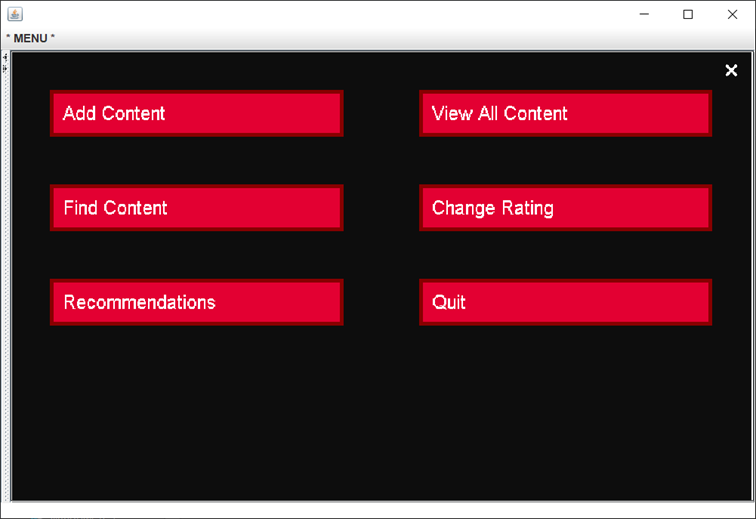
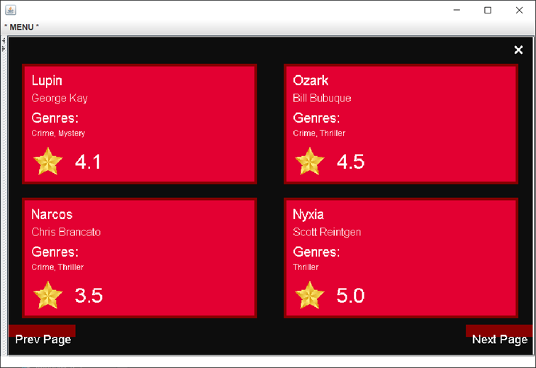
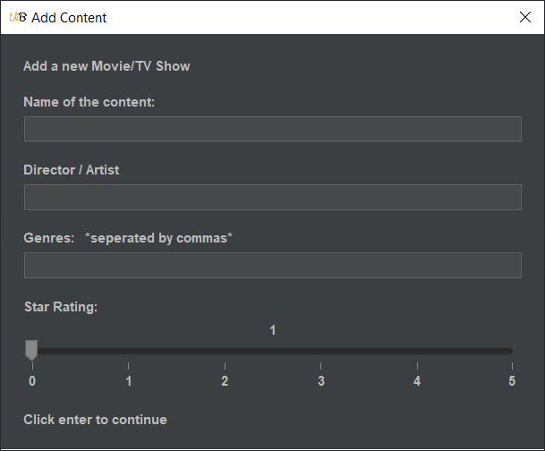
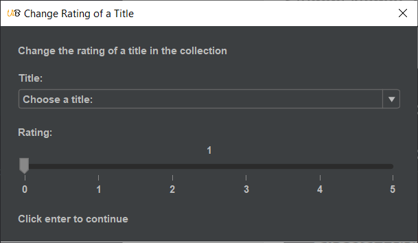

<!-- PROJECT SHIELDS -->
<!--
*** I'm using markdown "reference style" links for readability.
*** Reference links are enclosed in brackets [ ] instead of parentheses ( ).
*** See the bottom of this document for the declaration of the reference variables
*** for contributors-url, forks-url, etc. This is an optional, concise syntax you may use.
*** https://www.markdownguide.org/basic-syntax/#reference-style-links
-->
[![Contributors][contributors-shield]][contributors-url] [![Forks][forks-shield]][forks-url] [![Stargazers][stars-shield]][stars-url] [![Issues][issues-shield]][issues-url] [![MIT License][license-shield]][license-url]


<!-- Replace Names -->
<!-- 
*** Project Name:     Content Recommender
*** Purpose:          PROGRAM-PURPOSE
 -->


<!-- PROJECT LOGO -->
<br />
<p align="center">
    <h1 align="center"> Content Recommender Java </h1>
    <!-- <h5 align="center" style='margin-top: 0px;'> AS 91901: Apply user experience methodologies to develop a design for a digital technologies outcome  </h4> -->

  <p align="center">
    Here is the ReadMe file for my Content Recommender Java Program.  For this assignment we were tasked to create a recommender system given a dataset of movies or music albums, users and their ratings
    <br />
    <br />
  </p>
</p>

___


<!-- ABOUT THE PROJECT -->
<!-- ## About The Project -->
<h2 style='margin-bottom: 5px;'> About The Project </h2> 
<h5 style='margin-top: 0px;'> AS 91901: Apply user experience methodologies to develop a design for a digital technologies outcome  </h4>

Content Recommender is the project I have been working on for the Project Management NZCEA Level 3 standard. I started the project on 26th August and finished on the 10th October


#### Problem Statement

Recommender systems are commonly recognised as playlist generators for video and music services like Netflix, YouTube and Spotify, product recommenders for services such as Amazon, or content recommenders for social media platforms such as Facebook and Twitter. 

“In October 2006, Netflix released a dataset containing 100 million anonymous movie ratings and challenged the data mining, machine learning and computer science communities to develop systems that could beat the accuracy of its recommendation system, Cinematch” (Bennett & Lanning, 2007). 
Given a dataset of movies or music albums, users and their ratings, you are to create a recommender system. 


### Built With

* Java (Maven Project)
* ECS100 Library
* UiBooster Library 

<!-- GETTING STARTED -->
## Getting Started

Getting started using this projetc is quite easy. Download a local copy of the project, navigate to the project directory ```recommener/srs/main/java/com/robionyrogers/GUI.java``` and run the file. 

### Installation

1. Clone the repo using Git
```sh
git clone https://github.com/JamisBuggerlugs/Project-Management-Internal-2021.git
```
2. Download the zip file from above

3. Run the file ```GUI.java``` found under: ```recommener/srs/main/java/com/robionyrogers```

<!-- USAGE EXAMPLES -->
## Usage

Here are some screenshots of the program in use. Below we have a series of speraerate screens found in the outcome

##### Menu and View All Content screens 
<p float="left" align="middle" >
    
    
</p>

##### UiBooster Window Inputs 
<p float="left" align="middle">
    
    
</p>

<!-- Use this space to show useful examples of how a project can be used. Additional screenshots, code examples and demos work well in this space. You may also link to more resources. -->

## Tasks Moving Forward
- [ ] Read the FIXME/TODO comments in the code
- [ ] Use the MovieDB api for better recommendations


___

<!-- CONTACT -->
## Contact

James Robiony-Rogers - james.robiony-rogers@student.onslow.school.nz


<!-- MARKDOWN LINKS & IMAGES -->
<!-- https://www.markdownguide.org/basic-syntax/#reference-style-links -->
[contributors-shield]: https://img.shields.io/github/contributors/jamisbuggerlugs/Python_Tutorial_Website.svg?style=flat-square
[contributors-url]: https://github.com/JamisBuggerlugs/Python_Tutorial_Website/graphs/contributors
[forks-shield]: https://img.shields.io/github/forks/JamisBuggerlugs/Python_Tutorial_Website.svg?style=flat-square
[forks-url]: https://github.com/JamisBuggerlugs/Python_Tutorial_Website/network/members
[stars-shield]: https://img.shields.io/github/stars/JamisBuggerlugs/Python_Tutorial_Website.svg?style=flat-square
[stars-url]: https://github.com/JamisBuggerlugs/Python_Tutorial_Website/stargazers
[issues-shield]: https://img.shields.io/github/issues/JamisBuggerlugs/Python_Tutorial_Website.svg?style=flat-square
[issues-url]: https://github.com/JamisBuggerlugs/Python_Tutorial_Website/issues
[license-shield]: https://img.shields.io/github/license/JamisBuggerlugs/Python_Tutorial_Website.svg?style=flat-square
[license-url]: https://github.com/JamisBuggerlugs/Python_Tutorial_Website/blob/master/LICENSE.txt
[linkedin-shield]: https://img.shields.io/badge/-LinkedIn-black.svg?style=flat-square&logo=linkedin&colorB=555
[linkedin-url]: https://linkedin.com/in/JamisBuggerlugs
[product-screenshot]: imgs/readme-assets/desktop-home-light.png
